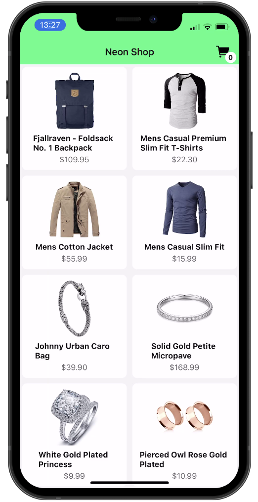
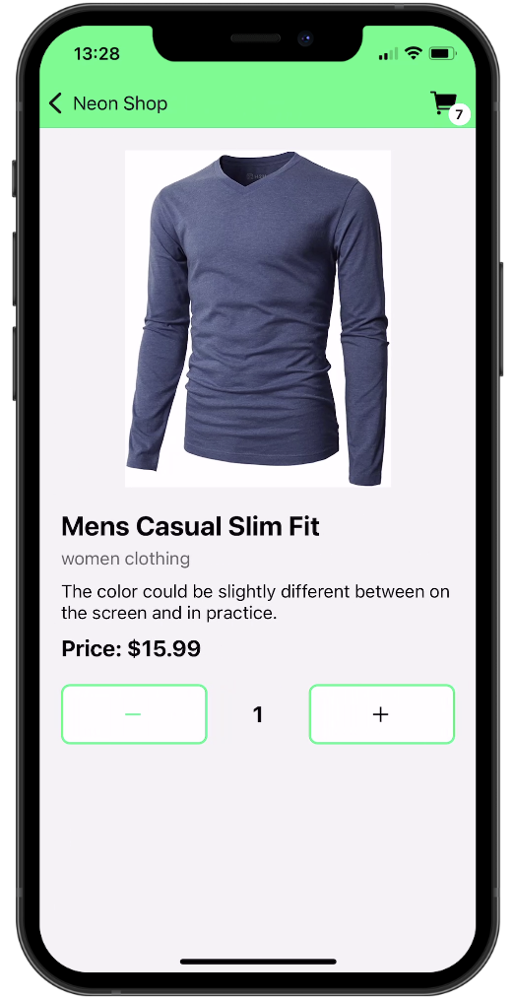
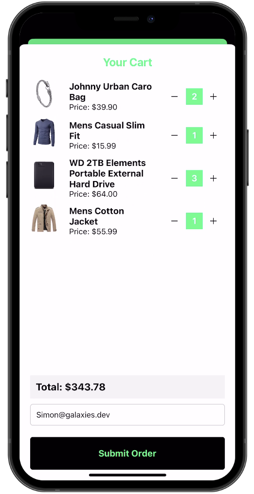
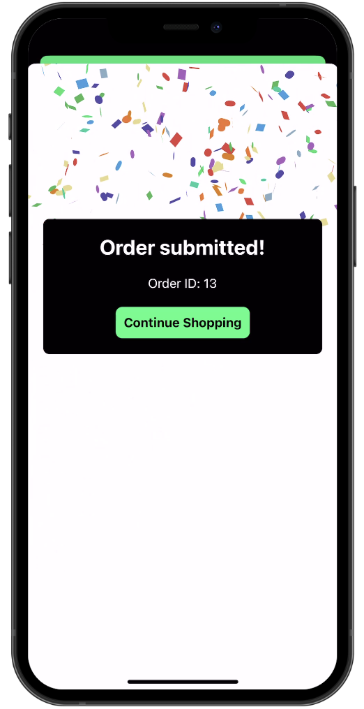

# React Native Shopping App

This is the frontend of the app using NeonDb and experss as backend.

The original dependency on the expo go framework is removed from this app to make it more compatible for @react-native-firebase library. This integrates Firebase into the react native app. 

first install the dependencies using the command:

```bash
npm install
```
This installs the required packages and dependencies in the npm module app

```bash
npx expo prebuild
```
This builds the expo app into a android app that can run firebase analytics realtime 

Make the following changes in the given directories as well:
Go to the firebase console and sign in using the company email. From 


Make sure to run the backend server as well!
## Preview
<div style="display: flex; flex-direction: 'row';">





</div>
